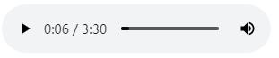

# `<audio>` 和 `<video>` 元素

## 1. 概述

`<video>` 元素用来加载视频，是 `HTMLVideoElement` 对象的实例。`<audio>`元素用来加载音频，是 `HTMLAudioElement` 对象的实例。而 `HTMLVideoElement` 和 `HTMLAudioElement` 都继承了 `HTMLMediaElement`。

```javascript
let a = new Audio();
a instanceof HTMLAudioElement; // true
a instanceof HTMLMediaElement; // true

let v = new Video();
v instanceof HTMLVideoElement;  // true
v instanceof HTMLMediaElement;  // true
```

理论上，这两个 HTML 元素直接用 `src` 属性指定媒体文件，就可以使用了。

```html
<audio src="background_music.mp3" />
<video src="news.mov" width=320 height=240 />
```

**`<video>` 元素有 `width` 属性和 `height` 属性，可以指定宽和高。`<audio>` 元素没有这两个属性，因为它的播放器外形是浏览器给定的，不能指定。**

实际上，不同的浏览器支持不同的媒体格式，我们不得不用 `<source>` 元素指定同一个媒体文件的不同格式。

```html
<audio id="music"> <!-- 浏览器遇到支持的格式，就会忽略后面的格式 -->
  <source src="music.mp3" type="audio/mpeg">  
  <source src="music.ogg" type='audio/ogg; codec="vorbis"'>
</audio>
```

这两个元素都有一个 `controls` 属性，只有打开这个属性，才会显示控制条。 **`<audio>` 元素如果不打开 controls 属性，根本不会显示。**

```javascript
<audio src="../media/最美的期待.m4a" controls></audio> // 不加 `controls` 才显示
```



## 2. HTMLMediaElement 接口

`HTMLMediaElement` 并没有对应的 HTML 元素，而是作为 `<video>` 和 `<audio>` 的基类，定义一些它们共同的属性和方法。

### 2.1. `HTMLMediaElement` 属性

一些常见重点属性：

- `autoplay`：布尔值，媒体文件是否自动播放，对应 HTML 属性 `autoplay`。
- `controls`：布尔值，是否显示媒体文件的控制栏，对应 HTML 属性 `controls`。
- `crossOrigin`：字符串，跨域请求时是否附带用户信息（比如 `Cookie`），对应 HTML 属性 `crossorigin`。该属性只有两个可能的值：`anonymous` 和 `use-credentials`。
- `currentTime`：浮点数，当前播放的时间点。
- `defaultPlaybackRate`：浮点数，默认的播放速率，默认是 `1.0`。
- `disableRemotePlayback`：布尔值，是否允许远程回放，即远程回放的时候是否会有工具栏。
- `duration`：浮点数，媒体文件的时间长度（单位秒）。如果当前没有媒体文件，该属性返回0。该属性只读。
- `ended`：布尔值，当前媒体文件是否已经播放结束。该属性只读。
- `error`：返回最近一次报错的错误对象，如果没有报错，返回 `null`。
- `loop`：布尔值，媒体文件是否会循环播放，对应 HTML 属性 `loop`。
- `muted`：布尔值，音量是否关闭。
- `networkState`：当前网络状态，共有四个可能的值。0没有数据；1媒体元素处在激活状态，但是还没开始下载；2下载中；3没有找到媒体文件。
- `paused`：布尔值，媒体文件是否处在暂停状态。该属性只读。
- `played`：返回一个 `TimeRanges`  对象，播放的媒体内容。该属性只读。
- `preload`：字符串，应该预加载哪些内容，可能的值为 `none`、`metadata` 和 `auto`。
- `readyState`：整数，媒体文件的准备状态，可能的值为 `0`（没有任何数据）、`1`（已获取元数据）、`2`（可播放当前帧，但不足以播放多个帧）、`3`（可以播放多帧，至少为两帧）、`4`（可以流畅播放）。该属性只读。
- `src`：布尔值，媒体文件的 `URL`，对应 HTML 属性 `src`。
- `srcObject`：返回 `src` 属性对应的媒体文件资源，可能是 `MediaStream`、`MediaSource`、`Blob` 或 `File` 对象。直接指定这个属性，就可以播放媒体文件。
- `textTracks`：返回一个类似数组的对象，包含所有文本轨道。该属性只读。
- `videoTracks`：返回一个类似数组的对象，包含多有视频轨道。该属性只读。
- `volume`：浮点数，音量。`0.0` 静音，`1.0` 最大音量。

### 2.2. HTMLMediaElement方法

`play()` 方法的例子：

```javascript
let myVideo = document.getElementById('myVideoElement');
myVideo.play().then(() => {
  console.log('playing');
}).catch((error) => {
  console.log(error);
});
```

## 3. HTMLVideoElement 接口

`HTMLVideoElement` 接口代表了 `<video>` 元素。这个接口继承了 `HTMLMediaElement`接口，并且有一些自己的属性和方法。

### 3.1. HTMLVideoElement 属性

- `height`：字符串，视频播放区域的高度（单位像素），对应 HTML 属性 `height`。
- `width`：字符串，视频播放区域的宽度（单位像素），对应 HTML 属性 `width`。
- `videoHeight`：只读，返回一个整数，视频文件自身的高度（单位像素）。
- `videoWidth`：只读，返回一个整数，视频文件自身的宽度（单位像素）。
- `poster`：字符串，一个图像文件的 URL，用来在无法获取视频文件时替代显示，对应 HTML 属性 `poster`。

### 3.2. HTMLVideoElement 方法

`getVideoPlaybackQuality()`：返回一个对象，包含了当前视频回放的一些数据。

## 4. HTMLAudioElement 接口

`HTMLAudioElement` 接口代表了 `<audio>` 元素。该接口继承了 `HTMLMediaElement`，但是没有定义自己的属性和方法。浏览器原生提供一个 `Audio()` 构造函数，返回的就是 `HTMLAudioElement` 实例。

```javascript
let song = new Audio([URLString]);
```

`Audio()` 构造函数接受一个字符串作为参数，表示媒体文件的 `URL`。如果省略这个参数，可以稍后通过 `src` 属性指定。

```javascript
let a = document.getElementsByTagName("audio")[0];
a.onvolumechange = () => { // 当每一次改变音量时触发
  console.log("The volume changed");
};
// 或者
a.addEventListener('volumechange', () => { // 当每一次改变音量时触发
  console.log('The volume changed');
});
```
