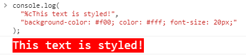

# console 对象

## 1. `console.log()`

如果第一个参数是格式字符串（使用了格式占位符，`console.log()` 方法将依次使用后面的参数替换占位符，然后再进行输出。

```javascript
console.log("%d + %d = %d", 1, 1, 2); // 1 + 1 = 2
```

`console.log` 方法支持以下占位符，不同类型的数据必须使用对应的占位符。

- `%s` 字符串
- `%d` 整数
- `%i` 整数
- `%f` 浮点数
- `%o` 对象的链接
- `%c` `CSS` 格式字符串

```javascript
console.log("%o", "https://www.baidu.com"); // "https://www.baidu.com"   可以点击直接跳转到百度

console.log("%cThis text is styled!", "background-color: #f00; color: #fff; font-size: 20px;");

const c = "color: #fff; background-color: #f00";
const s = "this text is styled!";
console.log("%c%s", c, s); // 这段代码将输出红底白字，但是前提是 %c 在前，%s 在后
```



## 2. `console.warn()` 和 `console.error()`

`console.warn()` 方法和 `console.error()` 方法也是在控制台输出信息，它们与 `console.log()` 方法的不同之处在于，`console.warn()` 方法输出信息时，在最前面加一个黄色三角，表示警告；`console.error()` 方法输出信息时，在最前面加一个红色的叉，表示出错。同时，还会高亮显示输出文字和错误发生的堆栈。其他方面都一样。

## 3. `console.table()`

对于某些复合类型的数据，`console.table()`方法可以把它转换为表格显示。

```javascript
const tableString = [
  { name: "HTML", fileExtension: ".html" },
  { name: "CSS", fileExtension: ".css" },
  { name: "JavaScript", fileExtension: ".js" },
];
console.table(tableString);
```

| (index) | name         | fileExtension |
| ------- | ------------ | ------------- |
| 0       | "HTML"       | ".html"       |
| 1       | "CSS"        | ".css"        |
| 2       | "JavaScript" | ".js"         |

## 3. `console.count()`

`console.count()` 方法用于计数，输出它被调用了多少次。

```javascript
function greet(user) {
  console.count();
  return "hi " + user;
}

greet("bob");
// default: 1
// "hi bob"

greet("alice");
// default: 2
// "hi alice"

greet("bob");
// default: 3
// "hi bob"
```

上面代码每次调用 `greet` 函数，内部的 `console.count()` 方法就输出执行次数。

## 4. `console.time()` 和 `console.timeEnd()`

**`console.time()` 和 `console.timeEnd()` 联合使用用于计时，且两个方法的传参一致时，可以算出一个操作所花费的准确时间，单位毫秒。**

`console.time()` 启动一个计时器，`console.timeEnd()` 停止一个通过 `console.time()` 启动的计时器。一旦停止，计时器所经过的时间会被自动输出到控制台。传参是作为计时器的名字，每一个计时器必须拥有唯一的名字，页面中最多能同时运行 10,000 个计时器。

```javascript
console.time("Array handle!");
let a = new Array(100000);
for (let i = 0, n = a.length; i < n; i++) {
  a[i] = i;
}
console.timeEnd("Array handle!");
// Array handle!: 4.082763671875 ms
```

## 5. 命令行 API

- `clear()`：清除控制台的历史。
- `copy(object)`：复制特定 DOM 元素到剪贴板。

```javascript
copy(document.getElementById("title")); // 复制 id 为 title 的 DOM 到剪贴板，可以直接粘贴到需要的地方
```
