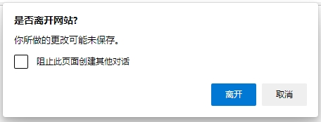

# 其他常见事件

## 1. 资源事件

### 1.1. beforeunload 事件

`beforeunload` 事件在窗口、文档、各种资源将要卸载前触发。它可以用来防止用户不小心卸载资源。

如果该事件对象的 `returnValue` 属性是一个非空字符串，那么浏览器就会弹出一个对话框，询问用户是否要卸载该资源。但是，用户指定的字符串可能无法显示，浏览器会展示预定义的字符串。如果用户点击“取消”按钮，资源就不会卸载。

```javascript
window.addEventListener('beforeunload', function (event) {
  event.returnValue = '你确定离开吗？';
});
```

用户如果关闭窗口，浏览器会弹出一个窗口，要求用户确认：



浏览器对这个事件的行为很不一致，有的浏览器调用event.preventDefault()，也会弹出对话框。IE 浏览器需要显式返回一个非空的字符串，才会弹出对话框。而且，**大多数浏览器在对话框中不显示指定文本，只显示默认文本。** 因此，可以采用下面的写法，取得最大的兼容性。

```javascript
window.addEventListener('beforeunload', function (e) {
  let confirmationMessage = '确认关闭窗口？';

  e.returnValue = confirmationMessage;
  return confirmationMessage;
});
```

**许多手机浏览器（比如 Safari）默认忽略这个事件，桌面浏览器也有办法忽略这个事件。所以，它可能根本不会生效，不能依赖它来阻止用户关闭浏览器窗口，最好不要使用这个事件。**

另外，一旦使用了beforeunload事件，浏览器就不会缓存当前网页，使用“回退”按钮将重新向服务器请求网页。这是因为监听这个事件的目的，一般是为了网页状态，这时缓存页面的初始状态就没意义了。

### 1.2. unload 事件

`unload` 事件在窗口关闭或者 `document` 对象将要卸载时触发。它的触发顺序排在 `beforeunload`、`pagehide` 事件后面。

`unload` 事件发生时，文档处于一个特殊状态。所有资源依然存在，但是对用户来说都不可见，UI 互动全部无效。这个事件是无法取消的，即使在监听函数里面抛出错误，也不能停止文档的卸载。

手机上，浏览器或系统可能会直接丢弃网页，这时该事件根本不会发生。而且跟beforeunload事件一样，一旦使用了unload事件，浏览器就不会缓存当前网页，理由同上。**任何情况下都不应该依赖这个事件，指定网页卸载时要执行的代码，可以考虑完全不使用这个事件。**

**`unload` 事件可以用 `pagehide` 代替。**

### 1.3. load 事件，error 事件

`load` 事件在页面或某个资源加载成功时触发。**页面或资源如果从浏览器缓存加载，并不会触发 `load` 事件。**

```javascript
window.addEventListener('load', function(event) {
  console.log('所有资源都加载完成');
});
```

`error` 事件是在页面或资源加载失败时触发。`abort` 事件在用户取消加载时触发。

这三个事件实际上属于进度事件，不仅发生在document对象，还发生在各种外部资源上面。浏览网页就是一个加载各种资源的过程，图像（image）、样式表（style sheet）、脚本（script）、视频（video）、音频（audio）、Ajax请求（XMLHttpRequest）等等。这些资源和document对象、window对象、XMLHttpRequestUpload 对象，都会触发load事件和error事件。

**页面的 `load` 事件也可以用 `pageshow` 事件代替。**

## 2. session 历史事件

### 2.1. `pageshow` 事件，`pagehide` 事件

默认情况下，浏览器会在当前会话（session）缓存页面，当用户点击“前进/后退”按钮时，浏览器就会从缓存中加载页面。

**`pageshow` 事件在页面加载时触发，包括第一次加载和从缓存加载两种情况。** 如果要指定页面每次加载（不管是不是从浏览器缓存）时都运行的代码，可以放在这个事件的监听函数。

**第一次加载时，它的触发顺序排在 `load` 事件后面。** 从缓存加载时，`load` 事件不会触发，因为网页在缓存中的样子通常是 `load` 事件的监听函数运行后的样子，所以不必重复执行。**如果是从缓存中加载页面，`DOMContentLoaded` 也不会执行。**

```javascript
window.addEventListener('pageshow', function(event) {
  console.log('pageshow: ', event);
});
```

`pageshow` 事件有一个 `persisted` 属性，返回一个布尔值。页面第一次加载时，这个属性是 `false`；当页面从缓存加载时，这个属性是 `true`。

```javascript
window.addEventListener('pageshow', function(event){
  if (event.persisted) { /* */ }
});
```

`pagehide` 事件与 `pageshow` 事件类似，当用户通过“前进/后退”按钮，离开当前页面时触发。它与 `unload` 事件的区别在于，如果在 `window` 对象上定义 `unload` 事件的监听函数之后，页面不会保存在缓存中，而使用 `pagehide` 事件，页面会保存在缓存中。

`pagehide` 事件实例也有一个 `persisted` 属性，将这个属性设为 `true`，就表示页面要保存在缓存中；设为 `false`，表示网页不保存在缓存中，这时如果设置了`unload` 事件的监听函数，该函数将在 `pagehide` 事件后立即运行。

如果页面包含 `<frame>` 或 `<iframe>` 元素，则 `<frame>` 页面的 `pageshow` 事件和 `pagehide` 事件，都会在主页面之前触发。

**这两个事件只在浏览器的 `history` 对象发生变化时触发，跟网页是否可见没有关系。**

### 2.2. popstate 事件

**`popstate` 事件在浏览器的 `history` 对象的当前记录发生显式切换时触发。调用 `history.pushState()` 或 `history.replaceState()`，并不会触发 `popstate` 事件。该事件只在用户在 `history` 记录之间显式切换时触发，比如鼠标点击“后退/前进”按钮，或者在脚本中调用 `history.back()`、`history.forward()`、`history.go()` 时触发。**

该事件对象有一个 `state` 属性，保存 `history.pushState` 方法和 `history.replaceState` 方法为当前记录添加的 `state` 对象。

```javascript
window.onpopstate = function (event) {
  console.log('state: ' + event.state);
};
history.pushState({page: 1}, 'title 1', '?page=1');
history.pushState({page: 2}, 'title 2', '?page=2');
history.replaceState({page: 3}, 'title 3', '?page=3');
history.back(); // state: {"page":1}
history.back(); // state: null
history.go(2);  // state: {"page":3}
```

浏览器对于页面首次加载，是否触发popstate事件，处理不一样，Firefox 不触发该事件。

### 2.3. hashchange 事件

`hashchange` 事件在 `URL` 的 `hash` 部分（即 `#` 号后面的部分，包括 `#` 号）发生变化时触发。该事件一般在 `window` 对象上监听。`hashchange` 的事件实例具有两个特有属性：`oldURL` 属性和 `newURL`属性，分别表示变化前后的完整 `URL`。

```javascript
// URL 是 http://www.example.com/
window.addEventListener('hashchange', myFunction);

function myFunction(e) {
  console.log(e.oldURL);
  console.log(e.newURL);
}

location.hash = 'part2';
// http://www.example.com/
// http://www.example.com/#part2
```

### 3. 网页状态事件

### 3.1. `DOMContentLoaded` 事件

网页下载并解析完成以后，浏览器就会在 `document` 对象上触发 `DOMContentLoaded` 事件。这时，仅仅完成了网页的解析（整张页面的 `DOM` 生成了），所有外部资源（样式表、脚本、iframe 等等）可能还没有下载结束。也就是说，这个事件比 `load` 事件发生时间早得多。

```javascript
document.addEventListener('DOMContentLoaded', function (event) {
  console.log('DOM生成');
});
```

**网页的 JavaScript 脚本是同步执行的，脚本一旦发生堵塞，将推迟触发 `DOMContentLoaded` 事件。**

### 3.2. readystatechange 事件

`readystatechange` 事件当 `Document` 对象和 `XMLHttpRequest` 对象的 `readyState` 属性发生变化时触发。`document.readyState` 有三个可能的值：`loading`（网页正在加载）、`interactive`（网页已经解析完成，但是外部资源仍然处在加载状态）和 `complete`（网页和所有外部资源已经结束加载，load事件即将触发）。

```javascript
document.onreadystatechange = function () {
  if (document.readyState === 'interactive') { /* */ }
}
```

## 4. 窗口事件

### 4.1. scroll 事件

`scroll` 事件在文档或文档元素滚动时触发，主要出现在用户拖动滚动条。

该事件会连续地大量触发，所以它的监听函数之中不应该有非常耗费计算的操作。使用 `setTimeout` 控制该事件的触发频率，然后可以结合 `customEvent` 抛出一个新事件。

上例中，throttle()函数用于控制事件触发频率，它有一个内部函数func()，每次scroll事件实际上触发的是这个函数。func()函数内部使用requestAnimationFrame()方法，保证只有每次页面重绘时（每秒60次），才可能会触发optimizedScroll事件，从而实际上将scroll事件转换为optimizedScroll事件，触发频率被控制在每秒最多60次。

改用 `setTimeout()` 方法，可以放置更大的时间间隔：

```javascript
(function() {
  window.addEventListener('scroll', scrollThrottler, false);

  let scrollTimeout;
  function scrollThrottler() {
    if (!scrollTimeout) {
      scrollTimeout = setTimeout(function () {
        scrollTimeout = null;
        actualScrollHandler();
      }, 66);
    }
  }
  function actualScrollHandler() { /* */ }
}());
```

上例中，每次 `scroll` 事件都会执行 `scrollThrottler` 函数。该函数里面有一个定时器 `setTimeout`，每 66 毫秒触发一次（每秒 15 次）真正执行的任务 `actualScrollHandler`。

`throttle` 函数的写法：

```javascript
function throttle(fn, wait) {
  let time = Date.now();
  return function() {
    if ((time + wait - Date.now()) < 0) {
      fn();
      time = Date.now();
    }
  }
}
window.addEventListener('scroll', throttle(callback, 1000));
```

`lodash` 函数库提供了现成的 `throttle` 函数，可以直接使用。

**`throttle` 是“节流”，确保一段时间内只执行一次，而 `debounce` 是“防抖”，要连续操作结束后再执行。以网页滚动为例，`debounce` 要等到用户停止滚动后才执行，`throttle` 则是如果用户一直在滚动网页，那么在滚动过程中还是会执行。**

### 4.2. resize 事件

`resize` 事件在改变浏览器窗口大小时触发，主要发生在 `window` 对象上面。

```javascript
let resizeMethod = function () {
  if (document.body.clientWidth < 768) {
    console.log('移动设备的视口');
  }
};

window.addEventListener('resize', resizeMethod, true);
```

该事件也会连续地大量触发，所以最好像上面的 `scroll` 事件一样，通过 `throttle` 函数控制事件触发频率。

### 4.3. fullscreenchange 事件，fullscreenerror 事件

`fullscreenchange` 事件在进入或退出全屏状态时触发，该事件发生在 `document` 对象上面。

```javascript
document.addEventListener('fullscreenchange', function (event) {
  console.log(document.fullscreenElement);
});
```

`fullscreenerror` 事件在浏览器无法切换到全屏状态时触发。

## 5. 剪贴板事件

- cut：将选中的内容从文档中移除，加入剪贴板时触发。
- copy：进行复制动作时触发。
- paste：剪贴板内容粘贴到文档后触发。

如果希望禁止输入框的粘贴事件，可以使用：

```javascript
inputElement.addEventListener('paste', e => e.preventDefault());
```

`cut`、`copy`、`paste` 这三个事件的事件对象都是 `ClipboardEvent` 接口的实例。

```javascript
document.addEventListener('copy', function (e) {
  e.clipboardData.setData('text/plain', 'Hello, world!');
  e.clipboardData.setData('text/html', '<b>Hello, world!</b>');
  e.preventDefault();
});
```

*上面的代码使得复制进入剪贴板的，都是开发者指定的数据，而不是用户想要拷贝的数据。*

## 6. 焦点事件

焦点事件发生在元素节点和 `document` 对象上面，与获得或失去焦点相关。它主要包括以下四个事件。

- focus：元素节点获得焦点后触发，该事件不会冒泡。
- blur：元素节点失去焦点后触发，该事件不会冒泡。
- focusin：元素节点将要获得焦点时触发，发生在 `focus` 事件之前。该事件会冒泡。
- focusout：元素节点将要失去焦点时触发，发生在 `blur` 事件之前。该事件会冒泡。

由于 `focus` 和 `blur` 事件不会冒泡，只能在捕获阶段触发，所以 `addEventListener` 方法的第三个参数需要设为 `true`。

```javascript
form.addEventListener('focus', function (event) {
  event.target.style.background = 'pink';
}, true);

form.addEventListener('blur', function (event) {
  event.target.style.background = '';
}, true);
```

上例针对表单的文本输入框，接受焦点时设置背景色，失去焦点时去除背景色。

## 7.CustomEvent 接口

`CustomEvent` 接口用于生成自定义的事件实例。那些浏览器预定义的事件，虽然可以手动生成，但是往往不能在事件上绑定数据。如果需要在触发事件的同时，传入指定的数据，就可以使用 CustomEvent 接口生成的自定义事件对象。

浏览器原生提供 `CustomEvent()` 构造函数，用来生成 CustomEvent 事件实例。

```javascript
new CustomEvent(type, options)
```

`CustomEvent()` 构造函数接受两个参数。第一个参数是字符串，表示事件的名字，这是必须的。第二个参数是事件的配置对象，这个参数是可选的。`CustomEvent` 的配置对象除了接受 Event 事件的配置属性，只有一个自己的属性。

- detail：表示事件的附带数据，默认为 `null`。

```javascript
let event = new CustomEvent('build', { 'detail': 'hello' });
function eventHandler(e) {
  console.log(e.detail);
}
document.body.addEventListener('build', function (e) {
  console.log(e.detail);
});
document.body.dispatchEvent(event);
```

上例中，手动定义了 `build` 事件。该事件触发后，会被监听到，从而输出该事件实例的 `detail` 属性（即字符串 `hello`）。

```javascript
let myEvent = new CustomEvent('myevent', {
  detail: {
    foo: 'bar'
  },
  bubbles: true,
  cancelable: false
});

el.addEventListener('myevent', function (event) {
  console.log('Hello ' + event.detail.foo);
});

el.dispatchEvent(myEvent);
```

上例也说明，`CustomEvent` 的事件实例，除了具有 `Event` 接口的实例属性，还具有 `detail` 属性。
