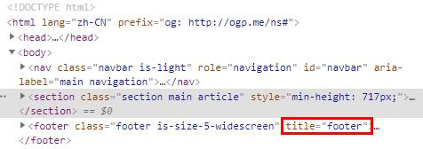

# Element 节点

`Element` 节点对象对应网页的 HTML 元素。每一个 HTML 元素，在 DOM 树上都会转化成一个 `Element` 节点对象（以下简称元素节点）。

元素节点的 `nodeType` 属性都是 `1`。

```javascript
let p = document.querySelector('p');
p.nodeName // "P"
p.nodeType // 1
```

`Element` 对象继承了 `Node` 接口，因此 `Node` 的属性和方法在 `Element` 对象都存在。

此外，不同的 HTML 元素对应的元素节点是不一样的，浏览器使用不同的构造函数，生成不同的元素节点，比如 `<a>` 元素的构造函数是 `HTMLAnchorElement()` ，`<button>`是 `HTMLButtonElement()`。因此，元素节点不是一种对象，而是许多种对象，这些对象除了继承 `Element` 对象的属性和方法，还有各自独有的属性和方法。

## 1. 实例属性

### 1.1. 元素特征相关属性

#### 1.1.1. Element.id

`Element.id` 属性返回元素的 `id` 属性，该属性可读写。

```javascript
//  
let logo = document.getElementById("logo");
logo.id  // "logo"
```

`id` 属性的值是大小写敏感，即浏览器能正确识别 `<p id="foo">` 和 `<p id="FOO">` 这两个元素的 `id` 属性，但是最好不要这样命名，统一使用小写。

#### 1.1.2. Element.tagName

`Element.tagName` 属性返回指定元素的大写标签名，与 `nodeName` 属性的值相等。

```javascript
// 
let logo = document.getElementById("logo");
console.log(logo.tagName);  // IMG
console.log(logo.nodeName);  // IMG
```

#### 1.1.3. Element.accesskey

`Element.accesskey` 属性用于读写分配给当前元素的快捷键。

```javascript
// <a href="https://www.baidu.com" accesskey="h" id="dom" title="baidu" name="dom">百度</a>
let anchor = document.getElementById("dom");
anchor.accesskey  // "h"
```

上面代码给 `<a>` 标签定义了快捷键 `h`，当使用快捷键时，可代替点击跳转到 `https://www.baidu.com` 网页。在 window 系统中是使用 `alt + h` 快捷键。

#### 1.1.4. Element.draggable

`Element.draggable` 属性返回一个布尔值，表示当前元素是否可拖动。该属性可读写。

#### 1.1.5. Element.lang

`Element.lang` 属性返回当前元素的语言设置。该属性可读写。

```javascript
// <html lang="zh-CN">
document.documentElement.lang  // "zh-CN"

// <html lang="en">
document.documentElement.lang  // "en"
```

#### 1.1.6. Element.tabIndex

`Element.tabIndex` 属性返回一个整数，表示当前元素在 Tab 键遍历时的顺序。该属性可读写。

`tabIndex` 属性值如果是负值（通常是-1），则 Tab 键不会遍历到该元素。如果是正整数，则按照顺序，从小到大遍历。如果两个元素的 `tabIndex` 属性的正整数值相同，则按照出现的顺序遍历。遍历完所有tabIndex为正整数的元素以后，再遍历所有 `tabIndex` 等于0、或者属性值是非法值、或者没有`tabIndex` 属性的元素，顺序为它们在网页中出现的顺序。

#### 1.1.7. Element.title

`Element.title` 属性用来读写当前元素的 HTML 属性 `title`。该属性通常用来指定，鼠标悬浮时弹出的文字提示框。

```javascript
let footer = document.getElementsByClassName("footer")[0];
footer.title  // ""

footer.title = "footer"
```

上面代码获取 `<footer>` 元素的 `title` 属性时，是空，表示没有 `title` 属性或者 `title` 属性为空。然后给它设置了 `title` 属性。

