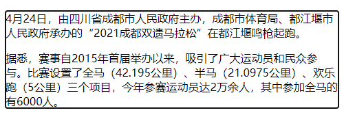

# Element 节点

`Element` 节点对象对应网页的 HTML 元素。每一个 HTML 元素，在 DOM 树上都会转化成一个 `Element` 节点对象（以下简称元素节点）。

元素节点的 `nodeType` 属性都是 `1`。

```javascript
let p = document.querySelector('p');
p.nodeName // "P"
p.nodeType // 1
```

`Element` 对象继承了 `Node` 接口，因此 `Node` 的属性和方法在 `Element` 对象都存在。

此外，不同的 HTML 元素对应的元素节点是不一样的，浏览器使用不同的构造函数，生成不同的元素节点，比如 `<a>` 元素的构造函数是 `HTMLAnchorElement()` ，`<button>`是 `HTMLButtonElement()`。因此，元素节点不是一种对象，而是许多种对象，这些对象除了继承 `Element` 对象的属性和方法，还有各自独有的属性和方法。

## 1. 实例属性

### 1.1. 元素特征相关属性

#### 1.1.1. Element.id

`Element.id` 属性返回元素的 `id` 属性，该属性可读写。

```javascript
//  
let logo = document.getElementById("logo");
logo.id  // "logo"
```

`id` 属性的值是大小写敏感，即浏览器能正确识别 `<p id="foo">` 和 `<p id="FOO">` 这两个元素的 `id` 属性，但是最好不要这样命名，统一使用小写。

#### 1.1.2. Element.tagName

`Element.tagName` 属性返回指定元素的大写标签名，与 `nodeName` 属性的值相等。

```javascript
// 
let logo = document.getElementById("logo");
console.log(logo.tagName);  // IMG
console.log(logo.nodeName);  // IMG
```

#### 1.1.3. Element.accesskey

`Element.accesskey` 属性用于读写分配给当前元素的快捷键。

```javascript
// <a href="https://www.baidu.com" accesskey="h" id="dom" title="baidu" name="dom">百度</a>
let anchor = document.getElementById("dom");
anchor.accesskey  // "h"
```

上面代码给 `<a>` 标签定义了快捷键 `h`，当使用快捷键时，可代替点击跳转到 `https://www.baidu.com` 网页。在 window 系统中是使用 `alt + h` 快捷键。

#### 1.1.4. Element.draggable

`Element.draggable` 属性返回一个布尔值，表示当前元素是否可拖动。该属性可读写。

#### 1.1.5. Element.lang

`Element.lang` 属性返回当前元素的语言设置。该属性可读写。

```javascript
// <html lang="zh-CN">
document.documentElement.lang  // "zh-CN"

// <html lang="en">
document.documentElement.lang  // "en"
```

#### 1.1.6. Element.tabIndex

`Element.tabIndex` 属性返回一个整数，表示当前元素在 Tab 键遍历时的顺序。该属性可读写。

`tabIndex` 属性值如果是负值（通常是-1），则 Tab 键不会遍历到该元素。如果是正整数，则按照顺序，从小到大遍历。如果两个元素的 `tabIndex` 属性的正整数值相同，则按照出现的顺序遍历。遍历完所有tabIndex为正整数的元素以后，再遍历所有 `tabIndex` 等于0、或者属性值是非法值、或者没有`tabIndex` 属性的元素，顺序为它们在网页中出现的顺序。

#### 1.1.7. Element.title

`Element.title` 属性用来读写当前元素的 HTML 属性 `title`。该属性通常用来指定，鼠标悬浮时弹出的文字提示框。

```javascript
let footer = document.getElementsByClassName("footer")[0];
footer.title  // ""

footer.title = "footer"
```

上面代码获取 `<footer>` 元素的 `title` 属性时，是空，表示没有 `title` 属性或者 `title` 属性为空。然后给它设置了 `title` 属性。


### 1.2. 元素状态相关属性

#### 1.2.1. Element.hidden

`Element.hidden` 属性返回一个布尔值，表示当前元素的 `hidden` 属性，用来控制当前元素是否可见。该属性可读写。

```javascript
let btn = document.getElementById('btn');
let mydiv = document.getElementById('mydiv');

btn.addEventListener('click', function () {
  mydiv.hidden = !mydiv.hidden;
}, false);
```

注意，该属性与 CSS 设置是互相独立的。CSS 对这个元素可见性的设置，`Element.hidden` 并不能反映出来。也就是说，**这个属性并不能用来判断当前元素的实际可见性**。

CSS 的设置高于 `Element.hidden`。如果 CSS 指定了该元素不可见（display: none）或可见（display: hidden），那么 `Element.hidden` 并不能改变该元素实际的可见性。换言之，**这个属性只在 CSS 没有明确设定当前元素的可见性时才有效。**

#### 1.2.2. Element.contentEditable 和 Element.isContentEditable

HTML 元素可以设置 `contentEditable` 属性，使得元素的内容可以编辑。

```javascript
<div contenteditable>123</div>
```

上面代码中，`<div>` 元素有 `contenteditable` 属性，因此用户可以在网页上编辑这个区块的内容。

`Element.contentEditable` 属性返回一个字符串，表示是否设置了contenteditable属性，有三种可能的值。该属性可写。

- `"true"`：元素内容可编辑
- `"false"`：元素内容不可编辑
- `"inherit"`：元素是否可编辑，继承了父元素的设置

`Element.isContentEditable` 属性返回一个布尔值，同样表示是否设置了 `contenteditable` 属性。该属性只读。

```html
<article contenteditable="true">
    <p>
    4月24日，由四川省成都市人民政府主办，成都市体育局、都江堰市人民政府承办的“2021成都双遗马拉松”在都江堰鸣枪起跑。
    </p>
    <p>
    据悉，赛事自2015年首届举办以来，吸引了广大运动员和民众参与。比赛设置了全马（42.195公里）、半马（21.0975公里）、欢乐跑（5公里）三个项目，今年参赛运动员达2万余人，其中参加全马的有6000人。
    </p>
</article>
```

上面代码设置了元素的 `contenteditable` 属性，该元素可编辑。



点击 `article` 元素区域，可以编辑该元素的内容。

```javascript
let article = document.getElementsByTagName("article")[0];
article.contentEditable  // "true"  获取 contentEditable 值，是 "true"

article.contentEditable = "false"  // "false"
article.isContentEditable  // false
```

上面代码：

1. 先获取元素的 `contentEditable` 属性，这时候返回 `"true"`，这时候元素可编辑
2. 将元素的编辑属性设置为 `"false"`，这时候元素不可编辑。
3. 获取元素的 `isContentEditable` 属性，返回 `false`。

#### 1.2.3. Element.attributes

`Element.attributes` 属性返回该元素的所有节点。

```javascript
// html
// <nav class="navbar" role="navigation" id="navbar" aria-label="main avigation"></nav>

let navbarLikeArray = document.getElementById("navbar");
navbarLikeArray.attributes
// NamedNodeMap {0: class, 1: role, 2: id, 3: aria-label, class: class, role: role, id: id, aria-label: aria-label, length: 4}
```

`Element.attribute` 属性返回类数组对象，所谓类数组对象是指本身属于对象，但包含 `length` 属性以及 `0`, `1` 这样的自然数属性。

与它相似的还有 `Element.getAttributeNames()` 方法，这个方法返回包含全部属性名的数组。

```javascript
navbarLikeArray.getAttributeNames()
// (4) ["class", "role", "id", "aria-label"]
```

#### 1.2.4. Element.className 和 Element.classList

`className` 属性用来读写当前元素节点的 `class` 属性。它的值是一个字符串，每个 `class` 之间用空格分割。

`classList` 属性返回一个类似数组的对象，当前元素节点的每个 `class` 就是这个对象的一个成员。

```javascript
// HTML 代码 <div class="one two three" id="myDiv"></div>
var div = document.getElementById('myDiv');

div.className
// "one two three"

div.classList
// {
//   0: "one"
//   1: "two"
//   2: "three"
//   length: 3
// }
```

上面代码中，`className` 属性返回一个空格分隔的字符串，而 `classList` 属性指向一个类似数组的对象，该对象的 `length` 属性（只读）返回当前元素的 `class` 数量。

`classList` 对象有下列方法。

- add()：增加一个 class。
- remove()：移除一个 class。
- contains()：检查当前元素是否包含某个 class。
- toggle()：将某个 class 移入或移出当前元素。
- item()：返回指定索引位置的 class。
- toString()：将 class 的列表转为字符串。

```javascript
var div = document.getElementById('myDiv');

div.classList.add('myCssClass');
div.classList.add('foo', 'bar');
div.classList.remove('myCssClass');
div.classList.toggle('myCssClass'); // 如果 myCssClass 不存在就加入，否则移除
div.classList.contains('myCssClass'); // 返回 true 或者 false
div.classList.item(0); // 返回第一个 Class
div.classList.toString();
```

下面比较一下，`className` 和 `classList` 在添加和删除某个 `class` 时的写法。

```javascript
var foo = document.getElementById('foo');

// 添加class
foo.className += 'bold';
foo.classList.add('bold');

// 删除class
foo.classList.remove('bold');
foo.className = foo.className.replace(/^bold$/, '');
```

`toggle()` 方法可以接受一个布尔值，作为第二个参数。如果为 `true`，则添加该属性；如果为 `false`，则去除该属性。

```javascript
el.classList.toggle('abc', boolValue);

// 等同于
if (boolValue) {
  el.classList.add('abc');
} else {
  el.classList.remove('abc');
}
```

#### 1.2.5. Element.dataset

网页元素可以自定义 `data-` 属性，用来添加数据。

```javascript
<div data-label="lableName"></div>
```

上面代码中，`<div>` 元素有一个自定义的 `data-label` 属性，用来为该元素添加一个标签。

`Element.dataset` 属性返回一个对象，可以从这个对象读写 `data-` 属性。

```javascript
// <article
//   id="foo"
//   data-columns="3"
//   data-index-number="12314"
//   data-parent="cars">
//   ...
// </article>
var article = document.getElementById('foo');
article.dataset.columns // "3"
article.dataset.indexNumber // "12314"
article.dataset.parent // "cars"
```

注意，`dataset` 上面的各个属性返回都是字符串。

HTML 代码中，`data-` 属性的属性名，只能包含英文字母、数字、连词线（`-`）、点（`.`）、冒号（`:`）和下划线（`_`）。它们转成 JavaScript 对应的 `dataset` 属性名，规则如下。

- 开头的 `data-` 会省略。
- 如果连词线后面跟了一个英文字母，那么连词线会取消，该字母变成大写。
- 其他字符不变。
  
因此，`data-abc-def` 对应 `dataset.abcDef`，`data-abc-1` 对应 `dataset["abc-1"]`。

除了使用 `dataset` 读写 `data-` 属性，也可以使用 `Element.getAttribute()` 和 `Element.setAttribute()`，通过完整的属性名读写这些属性。

```html
<article data-from="baiduNews">
    <p>百年前，贯通燕山山脉通往北京西北方向的京张铁路是中国人自主设计、施工修建的第一条干线铁路。</p>
    <p>京张铁路的建成不仅是中国铁路的骄傲，更极大地振奋了中国人民的民族自信。</p>
</article>
```

```javascript
let article = document.getElementsByTagName("article")[0];

article2.dataset.from
// "baiduNews"
article2.getAttribute("data-from")
// "baiduNews"
```

#### 1.2.6. Element.innerHTML

`Element.innerHTML` 属性返回一个字符串，等同于该元素包含的所有 HTML 代码。该属性可读写，常用来设置某个节点的内容。它能改写所有元素节点的内容，包括 `<HTML>` 和 `<body>` 元素。

如果将 `innerHTML` 属性设为空，等于删除所有它包含的所有节点。

```javascript
el.innerHTML = '';
```

上面代码等于将 `el` 节点变成了一个空节点，`el` 原来包含的节点被全部删除。

注意，读取属性值的时候，如果文本节点包含 `&`、小于号（`<`）和大于号（`>`），`innerHTML` 属性会将它们转为实体形式 `&amp;`、`&lt;`、`&gt;`。如果想得到原文，建议使用 `element.textContent` 属性。

```javascript
// HTML代码如下 <p id="para"> 5 > 3 </p>
document.getElementById('para').innerHTML
// 5 &gt; 3
```

写入的时候，如果插入的文本包含 HTML 标签，会被解析成为节点对象插入 DOM。注意，如果文本之中含有 `<script>` 标签，虽然可以生成 `script` 节点，但是插入的代码不会执行。

```javascript
var name = "<script>alert('script')</script>";
el.innerHTML = name;
```

上面代码将脚本插入内容，脚本并不会执行。但是，innerHTML还是有安全风险的。

```javascript
var name = "";
el.innerHTML = name;
```

上面代码中，alert方法是会执行的。会弹出一个警告，且必须手动确定关闭。因此为了安全考虑，如果插入的是文本，最好用 `textContent` 属性代替 `innerHTML`。

#### 1.2.7. Element.outerHTML

`Element.outerHTML` 属性返回一个字符串，表示当前元素节点的所有 HTML 代码，包括该元素本身和所有子元素。

```javascript
// HTML 代码如下
// <div id="d"><p>Hello</p></div>
var d = document.getElementById('d');
d.outerHTML
// '<div id="d"><p>Hello</p></div>'
```

`outerHTML` 属性是可读写的，对它进行赋值，等于替换掉当前元素。

```javascript
// HTML 代码如下
// <div id="container"><div id="d">Hello</div></div>
var container = document.getElementById('container');
var d = document.getElementById('d');
container.firstChild.nodeName // "DIV"
d.nodeName // "DIV"

d.outerHTML = '<p>Hello</p>';
container.firstChild.nodeName // "P"
d.nodeName // "DIV"
```

上面代码中，变量 `d` 代表子节点，它的 `outerHTML` 属性重新赋值以后，内层的 `div` 元素就不存在了，被 `p` 元素替换了。但是，变量 `d` 依然指向原来的 `div` 元素，这表示**被替换的 `DIV` 元素还存在于内存中。**

注意，如果一个节点没有父节点，设置 `outerHTML` 属性会报错。

```javascript
var div = document.createElement('div');
div.outerHTML = '<p>test</p>';
// DOMException: This element has no parent node.
```

上面代码中，`div` 元素没有父节点，设置 `outerHTML` 属性会报错。

#### 1.2.8. Element.clientHeight，Element.clientWidth

`Element.clientHeight` 属性返回一个整数值，表示元素节点的 CSS 高度（单位像素），只对块级元素生效，对于行内元素返回 0。如果块级元素没有设置 CSS 高度，则返回实际高度。

除了元素本身的高度，它还包括 `padding` 部分，但是不包括 `border`、`margin`。如果有水平滚动条，还要减去水平滚动条的高度。注意，这个值始终是整数，如果是小数会被四舍五入。

`Element.clientWidth` 属性返回元素节点的 CSS 宽度，同样只对块级元素有效，也是只包括元素本身的宽度和 `padding`，如果有垂直滚动条，还要减去垂直滚动条的宽度。

`document.documentElement` 的 `clientHeight` 属性，返回当前视口的高度（即浏览器窗口的高度），等同于 `window.innerHeight` 属性减去水平滚动条的高度（如果有的话）。`document.body` 的高度则是网页的实际高度（全部内容所占的高度）。一般来说，`document.body.clientHeight` 大于 `document.documentElement.clientHeight` 。

```javascript
// 视口高度
document.documentElement.clientHeight

// 网页总高度
document.body.clientHeight
```