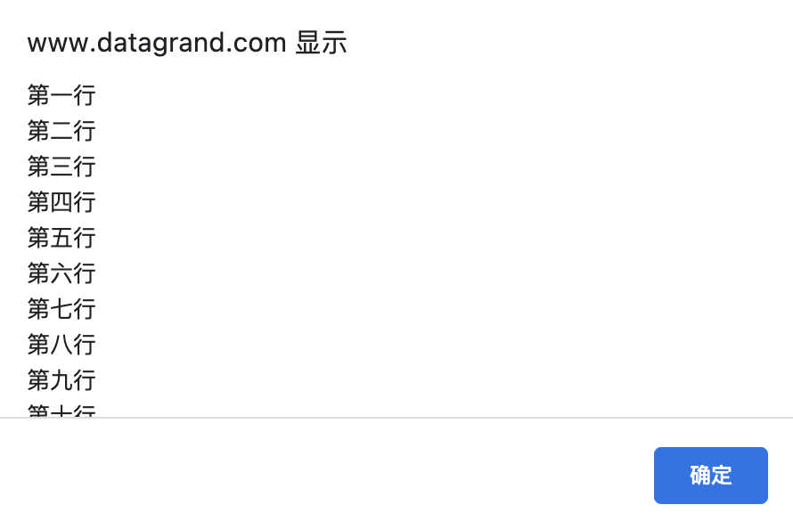

# window 对象

## 1. 概述

浏览器里面，`window` 对象（`w` 为小写）指当前的浏览器窗口。它也是当前页面的顶层对象，即最高一层的对象，所有其他对象都是它的下属。一个变量如果未声明，那么默认就是顶层对象的属性。

```javascript
a = 1;
window.a; // 1
```

上面代码中，`a` 是一个没有声明就直接赋值的变量，它自动成为顶层对象的属性。

`window` 有自己的实体含义，其实不适合当作最高一层的顶层对象，这是一个语言的设计失误。最早，设计这门语言的时候，原始设想是语言内置的对象越少越好，这样可以提高浏览器的性能。因此，语言设计者 `Brendan Eich` 就把 `window` 对象当作顶层对象，所有未声明就赋值的变量都自动变成 `window` 对象的属性。这种设计使得编译阶段无法检测出未声明变量，但到了今天已经没有办法纠正了。

## 2. window 对象的属性

### 2.1. window.name

`window.name` 属性是一个字符串，表示当前浏览器窗口的名字。窗口不一定需要名字，这个属性主要配合超链接和表单的 `target` 属性使用。

```javascript
window.name = 'Hello World!';
console.log(window.name);
// "Hello World!"
```

该属性只能保存字符串，如果写入的值不是字符串，会自动转成字符串。各个浏览器对这个值的储存容量有所不同，但是一般来说，可以高达几 `MB`。

只要浏览器窗口不关闭，这个属性是不会消失的。举例来说，访问 `a.com` 时，该页面的脚本设置了 `window.name`，接下来在同一个窗口里面载入了 `b.com`，新页面的脚本可以读到上一个网页设置的 `window.name`。页面刷新也是这种情况。一旦浏览器窗口关闭后，该属性保存的值就会消失，因为这时窗口已经不存在了。

### 2.2. window.closed，window.opener

`window.closed` 属性返回一个布尔值，表示窗口是否关闭。

```javascript
window.closed; // false
```

上面代码检查当前窗口是否关闭。这种检查意义不大，因为只要能运行代码，当前窗口肯定没有关闭。这个属性一般用来检查，使用脚本打开的新窗口是否关闭。

```javascript
let popup = window.open();

if (popup !== null && !popup.closed) {
  // 窗口仍然打开着
}
```

`window.opener` 属性表示打开当前窗口的父窗口。如果当前窗口没有父窗口（即直接在地址栏输入打开），则返回 `null`。

比如我从 `https://wangdoc.com/javascript/bom/index.html` 通过 `window.open()` 打开一个空白窗口。在空白窗口中：

```javascript
window.opener.location.href;

// https://wangdoc.com/javascript/bom/index.html
```

```javascript
window.open().opener === window; // true
```

上面表达式会打开一个新窗口，然后返回 `true`。

如果两个窗口之间不需要通信，建议将子窗口的 `opener` 属性显式设为 `null`，这样可以减少一些安全隐患。

```javascript
let newWin = window.open('example.html', 'newWindow', 'height=400,width=400');
newWin.opener = null;
```

上面代码中，子窗口的 `opener` 属性设为 `null`，两个窗口之间就没办法再联系了。

通过 `opener` 属性，可以获得父窗口的全局属性和方法，**但只限于两个窗口同源的情况**，且其中一个窗口由另一个打开。

比如我从 `https://wangdoc.com/javascript/bom/index.html` 通过 `window.open("https://www.baidu.com")` 打开百度搜索首页。在百度搜索首页：

```javascript
window.opener.location;

// {then: undefined, Symbol(Symbol.toStringTag): undefined, Symbol(Symbol.hasInstance): undefined, Symbol(Symbol.isConcatSpreadable): undefined, replace: ƒ}
```

因为两个网址不同源，故取不到父窗口的属性。

`<a>`元素添加 `rel="noopener"` 属性，可以防止新打开的窗口获取父窗口，减轻被恶意网站修改父窗口 `URL` 的风险。

```html
<a href="https://an.evil.site" target="_blank" rel="noopener"> 恶意网站 </a>
```

### 2.3. window.self，window.window

`window.self` 和 `window.window` 属性都指向窗口本身。这两个属性只读。

```javascript
window.self === window; // true
window.window === window; // true
```

### 2.4. window.frames，window.length

`window.frames` 属性返回一个类似数组的对象，成员为页面内所有框架窗口，包括 `frame` 元素和 `iframe` 元素。`window.frames[0]`表示页面中第一个框架窗口。

如果 `iframe` 元素设置了 `id` 或 `name` 属性，那么就可以用属性值，引用这个 `iframe` 窗口。比如 `<iframe name="myIFrame">` 可以用 `frames['myIFrame']` 或者 `frames.myIFrame` 来引用。

`frames` 属性实际上是 `window` 对象的别名。

```javascript
frames === window; // true
```

因此，`frames[0]` 也可以用 `window[0]` 表示。但是，从语义上看，`frames` 更清晰，而且考虑到 `window` 还是全局对象，因此推荐表示多窗口时，总是使用 `frames[0]` 的写法。

`window.length` 属性返回当前网页包含的框架总数。如果当前网页不包含 `frame` 和 `iframe` 元素，那么 `window.length` 就返回 `0`。

```javascript
window.frames.length === window.length; // true
```

上面代码表示，`window.frames.length` 与 `window.length` 应该是相等的。

### 2.5. window.frameElement

`window.frameElement` 属性主要用于当前窗口嵌在另一个网页的情况（嵌入 `<object>`、`<iframe>` 或 `<embed>`元素），返回当前窗口所在的那个元素节点。如果当前窗口是顶层窗口，或者所嵌入的那个网页不是同源的，该属性返回 `null`。

```javascript
// HTML 代码如下
// <iframe src="about.html"></iframe>

// 下面的脚本在 about.html 里面
let frameEl = window.frameElement;
if (frameEl) {
  frameEl.src = 'other.html';
}
```

上面代码中，`frameEl` 变量就是 `<iframe>` 元素。

### 2.6. window.top，window.parent

`window.top` 属性指向最顶层窗口，主要用于在框架窗口（`frame`）里面获取顶层窗口。

`window.parent` 属性指向父窗口。如果当前窗口没有父窗口，`window.parent` 指向自身。

```javascript
if (window.parent !== window.top) {
  // 表明当前窗口嵌入不止一层
}
```

对于不包含框架的网页，这两个属性等同于 `window` 对象。

### 2.7. window.status

`window.status` 属性用于读写浏览器状态栏的文本。但是，现在很多浏览器都不允许改写状态栏文本，所以使用这个方法不一定有效。

### 2.8. window.devicePixelRatio

`window.devicePixelRatio` 属性返回一个数值，表示一个 CSS 像素的大小与一个物理像素的大小之间的比率。也就是说，它表示一个 CSS 像素由多少个物理像素组成。它可以用于判断用户的显示环境，如果这个比率较大，就表示用户正在使用高清屏幕，因此可以显示较大像素的图片。

```javascript
devicePixelRatio;
// 2
```

华为手机 nova 5 Pro 的设备像素比率是 3。MacBook Pro 的设备像素比率是 2。

### 2.9. 位置大小属性

以下属性返回 `window` 对象的位置信息和大小信息。

（1）window.screenX，window.screenY

`window.screenX` 和 `window.screenY` 属性，返回浏览器窗口左上角相对于当前屏幕左上角的水平距离和垂直距离（单位像素）。这两个属性只读。

以 MacBook Pro 为例，屏幕顶部是菜单栏（左侧）和状态栏（右侧），`window.screenY` 返回的值就是顶部的高度，即浏览器窗口左上角相对于当前屏幕左上角的垂直距离。

（2） window.innerHeight，window.innerWidth

`window.innerHeight` 和 `window.innerWidth` 属性，返回网页在当前窗口中可见部分的高度和宽度，即“视口”（`viewport`）的大小（单位像素）。这两个属性只读。

用户放大网页的时候（比如将网页从 `100%` 的大小放大为 `200%`），这两个属性会变小。因为这时网页的像素大小不变（比如宽度还是 960 像素），只是每个像素占据的屏幕空间变大了，因此可见部分（视口）就变小了。

注意，这两个属性值包括滚动条的高度和宽度。

（3）window.outerHeight，window.outerWidth

`window.outerHeight` 和 `window.outerWidth` 属性返回浏览器窗口的高度和宽度，包括浏览器菜单和边框（单位像素）。这两个属性只读。

（4）window.scrollX，window.scrollY

`window.scrollX` 属性返回页面的水平滚动距离，`window.scrollY` 属性返回页面的垂直滚动距离，单位都为像素。这两个属性只读。

注意，这两个属性的返回值不是整数，而是双精度浮点数。如果页面没有滚动，它们的值就是 0。

举例来说，如果用户向下拉动了垂直滚动条 `75` 像素，那么 `window.scrollY` 就是 `75` 。用户水平向右拉动水平滚动条 `200` 像素，`window.scrollX` 就是 `200`。

```javascript
if (window.scrollY < 75) {
  window.scroll(0, 75);
}
```

上面代码中，如果页面向下滚动的距离小于 75 像素，那么页面向下滚动 75 像素。

（5）window.pageXOffset，window.pageYOffset

`window.pageXOffset` 属性和 `window.pageYOffset` 属性，是 `window.scrollX` 和 `window.scrollY` 别名。

### 2.10. 组件属性

组件属性返回浏览器的组件对象。这样的属性有下面几个。

- `window.locationbar`：地址栏对象
- `window.menubar`：菜单栏对象
- `window.scrollbars`：窗口的滚动条对象
- `window.toolbar`：工具栏对象
- `window.statusbar`：状态栏对象
- `window.personalbar`：用户安装的个人工具栏对象

这些对象的 `visible` 属性是一个布尔值，表示这些组件是否可见。这些属性只读。

- `window.locationbar.visible`
- `window.menubar.visible`
- `window.scrollbars.visible`
- `window.toolbar.visible`
- `window.statusbar.visible`
- `window.personalbar.visible`

### 2.11. 全局对象属性

全局对象属性指向一些浏览器原生的全局对象。

- `window.document`：指向 document 对象。**这个属性有同源限制。只有来自同源的脚本才能读取这个属性。**
- `window.location`：指向 Location 对象，用于获取当前窗口的 URL 信息。它等同于 `document.location` 属性。
- `window.navigator`：指向 `Navigator` 对象，用于获取环境信息。
- `window.history`：指向 `History` 对象，表示浏览器的浏览历史。
- `window.localStorage`：指向本地储存的 `localStorage` 数据。
- `window.sessionStorage`：指向本地储存的 `sessionStorage` 数据。
- `window.console`：指向 `console` 对象，用于操作控制台。
- `window.screen`：指向 `Screen` 对象，表示屏幕信息。
- `window.isSecureContext`: `window.isSecureContext` 属性返回一个布尔值，表示当前窗口是否处在加密环境。如果是 `HTTPS` 协议，就是 `true`，否则就是 `false`。

```javascript
// http://www.datagrand.com
window.isSecureContext; // false

// https://www.baidu.com
window.isSecureContext; // true
```

## 3. window 对象的方法

### 3.1. window.alert()，window.prompt()，window.confirm()

`window.alert()`、`window.prompt()`、`window.confirm()` 都是浏览器与用户互动的全局方法。它们会弹出不同的对话框，要求用户做出回应。注意，这三个方法弹出的对话框，都是浏览器统一规定的式样，无法定制。

（1）window.alert()

`window.alert()` 方法弹出的对话框，只有一个“确定”按钮，往往用来通知用户某些信息。

```javascript
window.alert('Hello World');
```

用户只有点击“确定”按钮，对话框才会消失。对话框弹出期间，浏览器窗口处于冻结状态，如果不点“确定”按钮，用户什么也干不了。

`window.alert()` 方法的参数只能是字符串，没法使用 CSS 样式，但是可以用 `\n` 指定换行。

```javascript
alert(
  '第一行\n第二行\n第三行\n第四行\n第五行\n第六行\n第七行\n第八行\n第九行\n第十行\n第十一行\n第十二行'
);
```



（2）window.prompt()

`window.prompt()`方法弹出的对话框，提示文字的下方，还有一个输入框，要求用户输入信息，并有“确定”和“取消”两个按钮。它往往用来获取用户输入的数据。

```javascript
let result = prompt('您的年龄？', 25);
```

上面代码会跳出一个对话框，文字提示为“您的年龄？”，要求用户在对话框中输入自己的年龄（默认显示 `25`）。用户填入的值，会作为返回值存入变量 `result`。

`window.prompt()` 的返回值有两种情况，可能是字符串（有可能是空字符串），也有可能是 `null`。具体分成三种情况。

- 用户输入信息，并点击“确定”，则用户输入的信息就是返回值。
- 用户没有输入信息，直接点击“确定”，则输入框的默认值就是返回值。
- 用户点击了“取消”（或者按了 ESC 按钮），则返回值是 null。

`window.prompt()` 方法的第二个参数是可选的，但是最好总是提供第二个参数，作为输入框的默认值。

（3）window.confirm()

`window.confirm()` 方法弹出的对话框，除了提示信息之外，只有“确定”和“取消”两个按钮，往往用来征询用户是否同意。

```javascript
let result = confirm('你最近好吗？');
```

上面代码弹出一个对话框，上面只有一行文字“你最近好吗？”，用户选择点击“确定”或“取消”。

`confirm` 方法返回一个布尔值，如果用户点击“确定”，返回 `true`；如果用户点击“取消”，则返回 `false`。

```javascript
let okay = confirm('Please confirm this message.');
if (okay) {
  // 用户按下“确定”
} else {
  // 用户按下“取消”
}
```

`confirm` 的一个用途是，用户离开当前页面时，弹出一个对话框，问用户是否真的要离开。

```javascript
window.onunload = function () {
  return window.confirm('你确定要离开当面页面吗？');
};
```

**这三个方法都具有堵塞效应，一旦弹出对话框，整个页面就是暂停执行，等待用户做出反应。**
