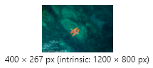

# `` 元素

## 1. 概述

`` 元素用于插入图片，主要继承了 `HTMLImageElement` 接口。

浏览器提供一个原生构造函数 `Image`，用于生成 `HTMLImageElement` 实例。

```javascript
let img = new Image();
img instanceof Image // true
img instanceof HTMLImageElement // true
```

`Image` 构造函数可以接受两个整数作为参数，分别表示 `` 元素的宽度和高度。

```javascript
// 语法
Image(width, height)
```

```javascript
// 用法
let myImage = new Image(100, 200);
```

`` 实例的 `src` 属性可以定义图像的网址。

```javascript
let img = new Image();
img.src = 'picture.jpg';
```

新生成的 `` 实例并不属于文档的一部分。如果想让它显示在文档中，必须手动插入文档。

```javascript
let img = new Image();
img.src = 'image1.png';
document.body.appendChild(img);
```

除了使用 `Image` 构造，下面的方法也可以得到 `HTMLImageElement` 实例。

- `document.images` 的成员
- 节点选取方法（比如 `document.getElementById`）得到的 `` 节点
- `document.createElement('img')` 生成的 `` 节点

```javascript
document.images[0] instanceof HTMLImageElement
// true

let img = document.getElementById('myImg');
img instanceof HTMLImageElement
// true

let img = document.createElement('img');
img instanceof HTMLImageElement
// true
```

`HTMLImageElement` 实例除了具有 `Node`、`Element`、`HTMLElement` 接口以外，还拥有一些独有的属性。这个接口没有定义自己的方法。

## 2. 特性相关的属性

### 2.1. HTMLImageElement.src

`HTMLImageElement.src` 属性返回图像的完整网址。

```javascript
// HTML 代码如下
// 
let img = document.getElementById('img');
img.src // http://example.com/pic.jpg
```

### 2.2. HTMLImageElement.currentSrc

`HTMLImageElement.currentSrc` 属性返回当前正在展示的图像的网址。JavaScript 和 CSS 的 mediaQuery 都可能改变正在展示的图像。

### 2.3. HTMLImageElement.alt

`HTMLImageElement.alt` 属性可以读写 `` 的属性 `alt`，表示对图片的文字说明。

### 2.4. HTMLImageElement.isMap 和 HTMLImageElement.useMap

`HTMLImageElement.isMap` 属性对应 `` 元素的属性 `ismap`，返回一个布尔值，表示图像是否为服务器端的图像映射的一部分。

`HTMLImageElement.useMap` 属性对应 `` 元素的属性 `usemap`，表示当前图像对应的 `<map>` 元素。

### 2.5. HTMLImageElement.srcset 和 HTMLImageElement.sizes

`HTMLImageElement.srcset` 属性和 `HTMLImageElement.sizes` 属性，分别用于读写`` 元素的 `srcset` 属性和 `sizes` 属性。它们用于 `` 元素的响应式加载。`srcset` 属性可以单独使用，但是 `sizes` 属性必须与 `srcset` 属性同时使用。

```javascript
// HTML 代码如下
// 
let img = document.getElementById('myImg');
img.srcset
// "example-320w.jpg 320w,
//  example-480w.jpg 480w,
//  example-800w.jpg 800w"

img.sizes
// "(max-width: 320px) 280px,
//  (max-width: 480px) 440px,
//  800px"
```

上面代码中，`sizes` 属性指定，对于小于 `320px` 的屏幕，图像的宽度为 `280px`；对于小于 `480px` 的屏幕，图像宽度为 `440px`；其他情况下，图像宽度为 `800px`。然后，浏览器会根据当前屏幕下的图像宽度，到 `srcset` 属性加载宽度最接近的图像。

### 2.6. HTMLImageElement.width 和 HTMLImageElement.height

`width` 属性表示 `` 的宽度，`height` 属性表示高度。这两个属性返回的都是整数。

```javascript
// HTML 代码如下
// 
let img = document.getElementById('img');
img.width // 300
img.height // 400
```

如果图像还没有加载，这两个属性返回的都是 0。

如果 HTML 代码没有设置 `width` 和 `height` 属性，则它们返回的是图像的实际宽度和高度，即 `HTMLImageElement.naturalWidth` 属性和 `HTMLImageElement.naturalHeight` 属性。

### 2.7. HTMLImageElement.naturalWidth 和 HTMLImageElement.naturalHeight

`HTMLImageElement.naturalWidth` 属性表示图像的实际宽度（单位像素），`HTMLImageElement.naturalHeight` 属性表示实际高度。这两个属性返回的都是整数。

如果图像还没有指定或不可得，这两个属性都等于0。

```javascript
let img = document.getElementById('img');
if (img.naturalHeight > img.naturalWidth) {
  img.classList.add('portrait');
}
```

上面代码中，如果图片的高度大于宽度，则设为 `portrait` 模式。

当图片还在加载中时，`naturalWidth` 和 `naturalHeight`，`width` 和 `height` 都是 0。加载完成后，`naturalWidth` 和 `naturalHeight`将返回原本的尺寸，通过浏览器调试，将鼠标悬浮在图片地址上将显示现在的显示尺寸和原本的尺寸（`intrinsic`）。

```html
<style>
.img-container {
    width: 400px;
    height: 500px;
}
.img-container img {
    display: block;
    max-width: 100%;
    height: auto;
}
</style>
<div class="img-container">
    
</div>
<script>
    let img = document.images[0];
    console.log("img.naturalWidth", img.naturalWidth);  // 0
    console.log("img.naturalHeight", img.naturalHeight);  // 0
    console.log("img.width", img.width);  // 0
    console.log("img.height", img.height);  // 0
    img.onload = () => {
        console.log(img.complete); // true
        console.log("completed-img.naturalWidth", img.naturalWidth);  // 1200
        console.log("completed-img.naturalHeight", img.naturalHeight);  // 800
        console.log("completed-img.width", img.width);  // 400
        console.log("completed-img.height", img.height);  // 267
    };
</script>
```



### 2.8. HTMLImageElement.complete

`HTMLImageElement.complete` 属性返回一个布尔值，表示图表是否已经加载完成。如果`` 元素没有 `src` 属性，也会返回 `true`。

**可以通过这个属性来判断图片是否已存在于缓存中**，通常如果图片较大，加载图片的时候可以添加一个加载动画，但如果是从缓存中拿去图片，就不需要显示动画。

```javascript
let img = new Image();
img.src = "src.jpg";

if (img.complete) {  // 从缓存中加载图片
    // to something
} else {
    // 显示动画
    // do something
}

img.onload = () => {
    // 结束动画
}
```

### 2.9. HTMLImageElement.crossOrigin

`HTMLImageElement.crossOrigin` 属性用于读写 `` 元素的 `crossorigin` 属性，表示跨域设置。

这个属性有两个可能的值。

- `anonymous`：跨域请求不要求用户身份（`credentials`），这是默认值。
- `use-credentials`：跨域请求要求用户身份。

```javascript
// HTML 代码如下
// 
let img = document.getElementById('img');
img.crossOrigin // "anonymous"
```

### 2.10. HTMLImageElement.referrerPolicy

`HTMLImageElement.referrerPolicy` 用来读写 `` 元素的属性 `referrerpolicy`，表示请求图像资源时，如何处理 HTTP 请求的 `referrer` 字段。

它有五个可能的值。

- `no-referrer`：不带有 `referrer` 字段。
- `no-referrer-when-downgrade`：如果请求的地址不是 HTTPS 协议，就不带有 `referrer` 字段，这是默认值。
- `origin`：`referrer` 字段是当前网页的地址，包含协议、域名和端口。
- `origin-when-cross-origin`：如果请求的地址与当前网页是同源关系，那么 `referrer` 字段将带有完整路径，否则将只包含协议、域名和端口。
- `unsafe-url`：`referrer` 字段包含当前网页的地址，除了协议、域名和端口以外，还包括路径。这个设置是不安全的，因为会泄漏路径信息。
  
### 2.11. HTMLImageElement.x 和 HTMLImageElement.y

`HTMLImageElement.x` 属性返回图像左上角相对于页面左上角的横坐标，`HTMLImageElement.y` 属性返回纵坐标。

## 3. 事件属性

图像加载完成，会触发 `onload` 属性指定的回调函数。

```javascript
// HTML 代码为 
function loadImage() {
  console.log('Image is loaded');
}
```

图像加载过程中发生错误，会触发 `onerror` 属性指定的回调函数。

```javascript
// HTML 代码为 
function myFunction() {
  console.log('There is something wrong');
}
```